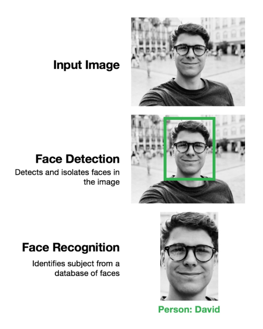
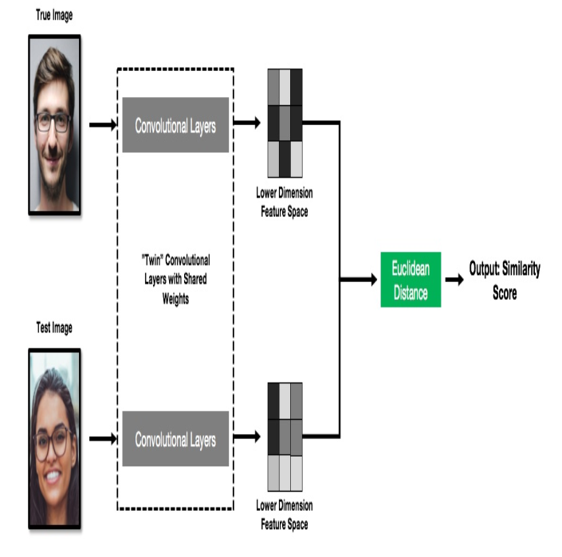

### A face recognition problem can be broken down into the following smaller subproblems
1. Face detection
2. Face recognition

# Face detection
Detect and isolate faces in the image. In an image with multiple faces, we need to detect each 
of them separately. In this step, we should also crop the detected faces from the original input 
image, to identify them separately.

# Face recognition
For each detected face in the image, we run it through a neural network to classify the subject. 
Note that we need to repeat this step for each detected face.

# Requirements of face recognition systems
1. Speed
2. Scalability
3. High accuracy with small data

## We'll create the facial recognition system using Naive one-shot prediction.

# Siamese neural networks
convolutional layers excel in finding such identifying features automatically. For facial recognition, researchers have found that when convolutional layers are applied to human faces, 
they extract spatial features, such as eyes and noses.

This insight forms the core of our algorithm for one-shot learning.
> Use convolutional layers to extract identifying features from faces. The output from the convolutional layers should be a mapping of the image to a lower-dimension feature space (for example, a 128 x 1 vector). The convolutional layers should map faces from the same subject close to
one another in this lower-dimension feature space and vice versa, faces from different subjects should be as far away as possible in this lowerdimension feature space.
    
> Using the Euclidean distance, measure the difference of the two lowerdimension vectors output from the convolutional layers. Note that there are two vectors, because we are comparing two images (the true image and the test image). The Euclidean distance is inversely proportional to the similarity between the two images.

Since we are feeding two images into our neural network simultaneously, we need two separate sets of convolutional layers. However, we require the two separate sets of convolutional layers to share the
same weights, because we want similar faces to be mapped to the same point in the lower-dimension feature space. If the weights from the two sets of convolutional layers are different, similar faces would be mapped to different points, and the Euclidean distance would not be a useful metric at all!
We can thus think of these two sets of convolutional layers as twins, as they share the same weights.
This neural network is known as a Siamese neural network, because just like a Siamese twin, it has a conjoined component at the convolutional layers.

# Contrastive loss
In distance-based predictions, loss functions based on accuracy would not work. Therefore, we require a new distance-based loss function to train our Siamese neural network for facial recognition. The distance-based loss function that we will be using is called the contrastive loss function.

Ytrue: Let Ytrue be 1 if the two input images are from the same subject (same face) and 0 if the two input images are from different subjects (different faces)
D: The predicted distance output from the neural network.

Contrastive loss = Ytrue * D2 + (1 - Ytrue) * max(margin - D, 0)

> Here, the margin is simply a constant regularizing term.

Simply produce a high loss (that is, a penalty) when the predicted distance is large when the faces are similar, and a low loss when the predicted distance is small, and vice versa for the case when the faces are different.