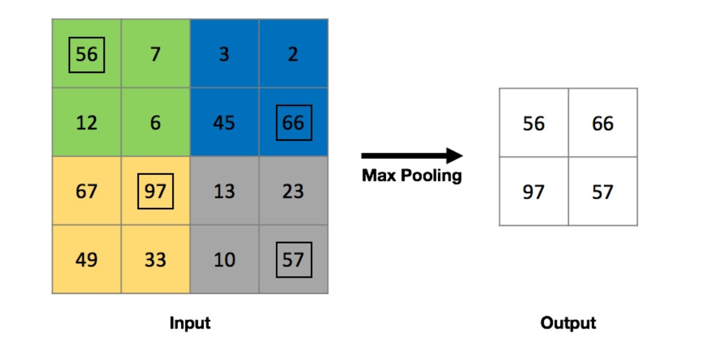

# Project Name : Cats Versus Dogs - Image Classification Using CNNs

## Motivation :

### Computer vision and object recognition :

Object recognition tasks can be broadly classified into three different types:

1. Image classification
2. Object detection
3. Instance segmentation

### Image classification

The input to the problem is an image and the required output is simply a prediction of the class that the image belongs
to.

### Object detection

The input to the problem is an image and the required output are bounding boxes surrounding the detected objects.

### Instance segmentation

The input to the problem is an image and the output are pixel groupings that correspond to each class.

### What is Convolution?

The process of sliding the window through the entire image and calculating the filtered value is known as convolution.

### What is Convolutional Layer?

The layer in the neural network that performs convolution is known as the convolutional layer.

### There are two main hyperparameters in a convolutional layer

1. Number of filters: Increase the number of filters to find multiple characteristic features.
2. Filter size: Tune the filter size to represent larger characteristic features

### What is Max pooling?

The objective of the max pooling layer is to reduce the number of weights after each convolution layer, thereby reducing
model complexity and avoiding overfitting.

As we can see from the preceding diagram, Max Pooling simply looks at each 2 x 2 region of the input, and discards all
but the maximum value in that region (boxed up in the preceding diagram). This effectively halves the height and width
of the original input, reducing the number of parameters before passing it to the next layer.

### What is a tensor?

A tensor is just an n-dimensional array.

### Note:

CNNs are almost always stacked together in a block of convolution and pooling pattern. The activation function used for
the convolution layer is usually ReLU.

The final layers in a CNN will always be Fully Connected layers (dense layers) with a sigmoid or softmax activation
function. Note that the sigmoid activation function is used for binary classification problems, whereas the softmax
activation function is used for multiclass classification problems.

### Names of CNN's from Past to Present

1. LeNet
2. AlexNet
3. VGG16
4. Inception
5. ResNet(Residual neural network)

### Image augmentation

Image augmentation is the creation of additional training data by making minor alterations to images in certain ways in
order to create new images

1. Image rotation
2. Image translation
3. Horizontal flip
4. Zooming into the image

### Image augmentation motivation

CNNs require a huge amount of training data before they can generalize well. Keras provides a handy 'ImageDataGenerator'
class to help us easily perform image augmentation.

### What is Transfer learning?

Transfer learning is a technique in machine learning where a model trained for a certain task is modified to make
predictions for another task.