# What is Sequential problems?
Sequential problems are a class of problem in machine learning in which the
order of the features presented to the model is important for making predictions

# When these problem usually arise?
Sequential problems are commonly encountered in the following
scenarios:
1. NLP, including sentiment analysis, language translation, and text prediction
2. Time series predictions

# What is RNN(Recurrent neural networks)?
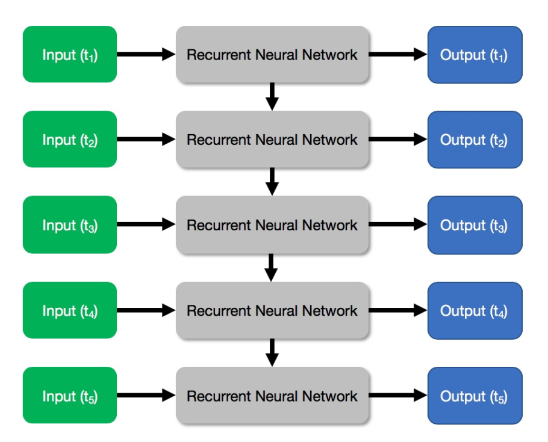

RNN is a multi-layered neural network. If the raw input is a sentence, we can break up the sentence into
individual words (in this case, every word represents a time step). Each word
will then be provided in the corresponding layer in the RNN as Input. More
importantly, each layer in an RNN passes its output to the next layer. The
intermediate output passed from layer to layer is known as the hidden state.
Essentially, the hidden state allows an RNN to maintain a memory of the
intermediate states from the sequential data.

# What's inside an RNN?
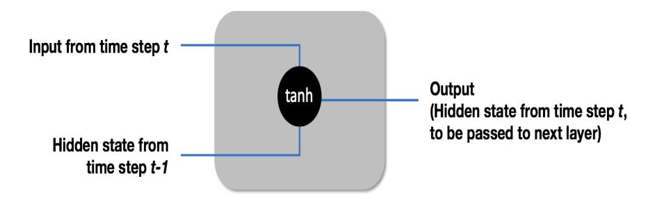

The mathematical function of an RNN is simple. Each layer t within an RNN has two inputs:
The input from the time step t
The hidden state passed from the previous layer t-1
Each layer in an RNN simply sums up the two inputs and applies a tanh
function to the sum. It then outputs the result, to be passed as a hidden state to
the next layer. It's that simple! More formally, the output hidden state of layer
t is this:

# What exactly is the tanh function? 
The tanh function is the hyperbolic tangent function, and it simply squashes a value between 1 and -1. 
The tanh function is a good choice as a non-linear transformation of the combination of the current input 
and the previous hidden state, because it ensures that the weights don't diverge too rapidly. It has also 
other nice mathematical properties, such as being easily differentiable.

# What is LSTM(long short-term memory)?
Learn lstm by example

We can treat this short sentence as sequential data by breaking it down into five different inputs, with each word at each time step
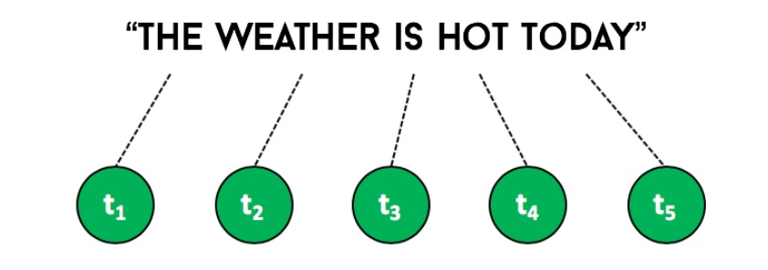
Now, suppose that we are building a simple RNN to predict whether is it snowing based on this sequential data
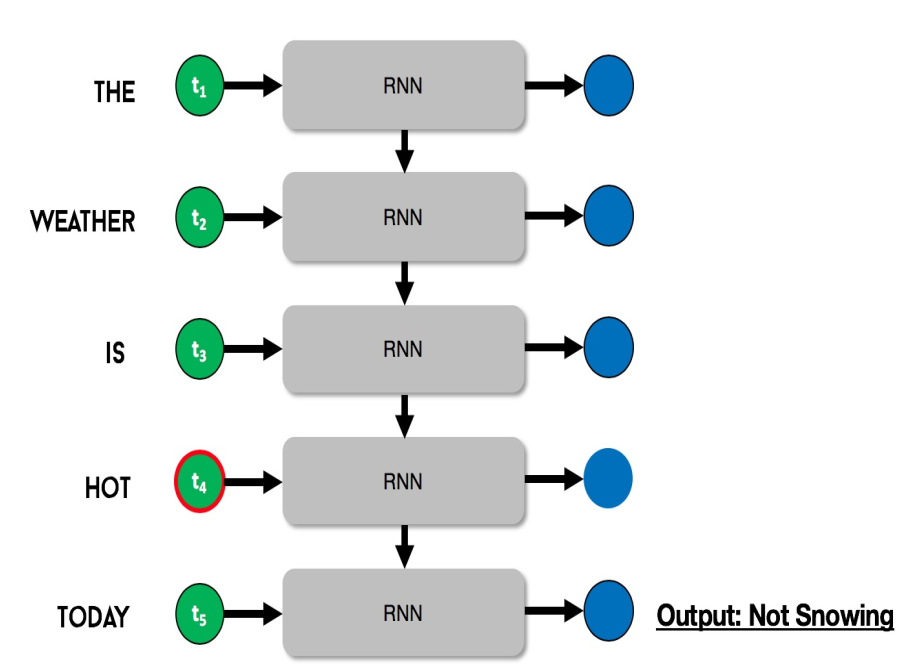

The critical piece of information in the sequence is the word HOT, at time step 4 (t4, circled in red). With this piece of information, 
the RNN is able to easily predict that it is not snowing today. Notice that the critical piece of information came just shortly before 
the final output. In other words, we would say that there is a short-term dependency in this sequence.

> ### Long Term memory with a long sentence example

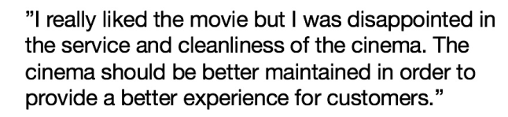
> Our goal is to predict whether the customer liked the movie.

Clearly, the customer liked the movie but not the cinema, which was the main complaint in the paragraph.

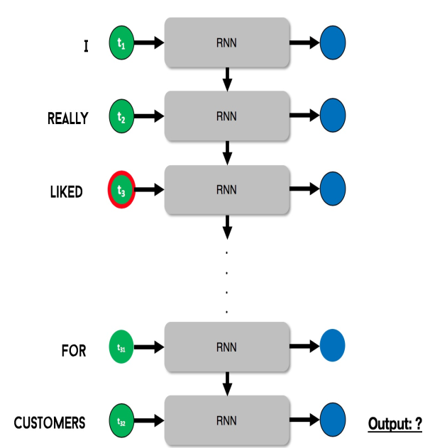

The critical words liked the movie appeared between time steps 3 and 5.
Notice that there is a significant gap between the critical time steps and the
output time step, as the rest of the text was largely irrelevant to the prediction
problem (whether the customer liked the movie). In other words, we say that
there is a long-term dependency in this sequence. Unfortunately, RNNs do not
work well with long-term dependency sequences. RNNs have a good shortterm memory, but a bad long-term memory.
> why this is so, we need to understand the vanishing gradient problem when training neural networks.

### What is Vanishing Gradient Problem?
The vanishing gradient problem is a problem when training deep neural networks using gradient-based methods such as backpropagation. the backpropagation algorithm in training neural networks. In particular, the loss function provides information on the accuracy of our predictions, and allows us to adjust the weights in each layer, to reduce the loss.

>So far, we have assumed that backpropagation works perfectly. Unfortunately, that is not true. When the loss is propagated backward, the loss tends to decrease with each successive layer

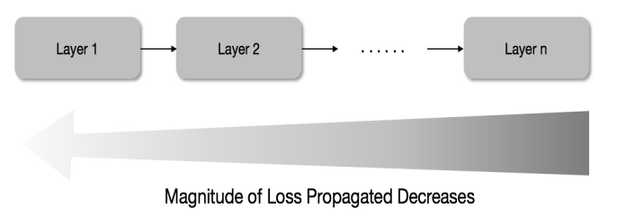

As a result, by the time the loss is propagated back toward the first few layers, the loss has already diminished so much that the weights do not change much at all. With such a small loss being propagated backward, it is impossible to adjust and train the weights of the first few layers. This phenomenon is
known as the <b>vanishing gradient problem</b> in machine learning.

> The vanishing gradient problem does not affect CNNs in computer vision problems.

> Sequential data and RNNs, the vanishing gradient can have a significant impact.

> #### The vanishing gradient problem means that RNNs are unable to learn from early layers (early time steps), which causes it to have poor long-term memory.

> # To solve this the LSTM Network born.

LSTMs are a variation of RNNs, and they solve the long-term dependency problem faced by conventional RNNs.

# LSTMs Intuition
Conventional RNNs. Conventional RNNs have a tendency to remember everything (even unnecessary inputs) that results in the inability to learn from long sequences. By contrast, LSTMs selectively remember important inputs, and this allows them to handle both short- and long-term dependencies.

# How LSTM network looks?
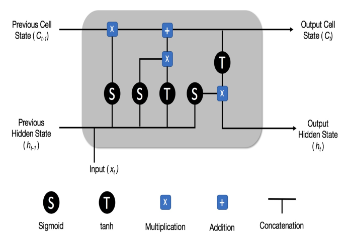

An LSTM differs from a conventional RNN in that it has a cell state, in addition to the hidden state. You can think of the cell state as the current memory of the LSTM. It flows from one repeating structure to the next, conveying important information that has to be retained at the moment. In contrast, the hidden state is the overall memory of the entire LSTM. It contains everything that we have seen so far, both important and unimportant information.

# How does the LSTM release information between the hidden state and the cell state? 
Using Three important gates:
* Forget gate
* Input gate
* Output gate

### Forget gate
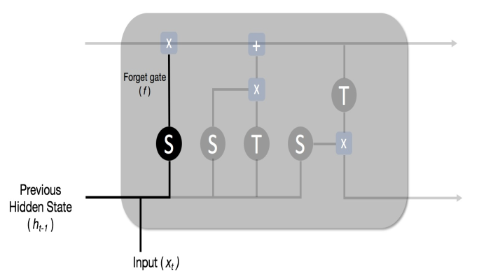

The Forget gate (f) forms the first part of the LSTM repeating unit, and its role is to decide how much data we should forget or remember from the previous cell state. It does so by first concatenating the Previous Hidden State (ht−1) and the current Input (xt), then passing the concatenated vector through a sigmoid function. The sigmoid function outputs a vector with values between 0 and 1. A value of 0 means to stop the information from passing through (forget), and a value of 1 means to pass the information through (remember).

### Input gate
The Input gate (i) controls how much information to pass to the current cell state.
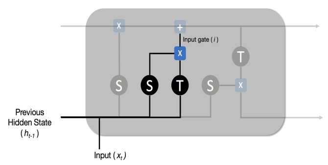

The Input gate (i) takes as input the concatenation of the Previous Hidden State (ht-1) and the current Input (xt). It then passes two copies of the concatenated vector through a sigmoid function and a tanh
function, before multiplying them together

The current cell state Ct is as follows:

  Ct = (forget_eq * Ct) + input_eq
  
### Output gate
The output gate controls how much information is to be retained in the hidden state.
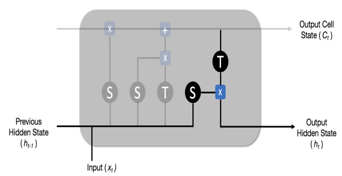

First, we concatenate the Previous Hidden State (ht−1) and the current Input (xt), and pass it through a sigmoid function. Then, we take the current cell state (Ct) and pass it through a tanh function. Finally, we take the multiplication of the two, which is passed to the next repeating unit as the hidden state (ht). 

