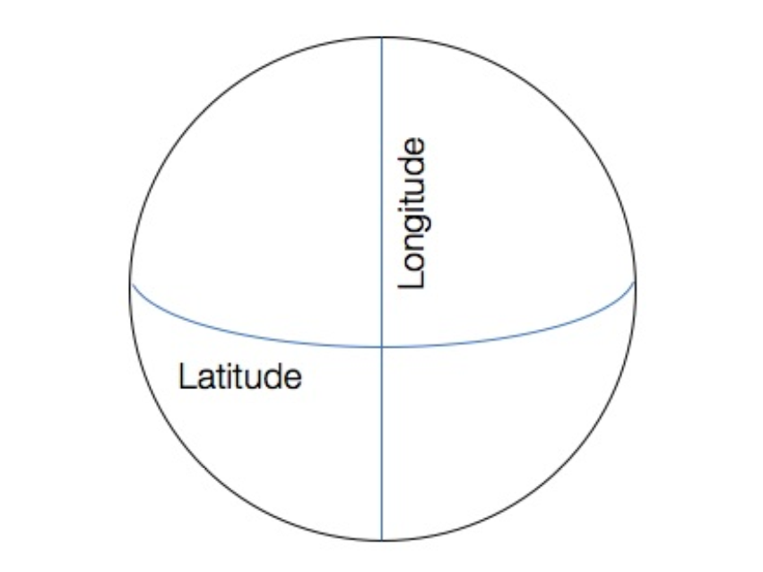

# Predicting taxi fares in New York City

## Motivation:

Yellow cabs in NYC are perhaps one of the most recognizable icons in the city. Tens of thousands of commuters in NYC
rely on taxis as a mode of transportation around the bustling metropolis. In recent years, the taxi industry in NYC has
been put under increasing pressure from ride-hailing apps such as Uber. In order to rise to the challenge from
ride-hailing apps, yellow cabs in NYCare looking to modernize their operations, and to provide a user experience on par
with Uber. In August 2018, the Taxi and Limousine Commission of NYC launched a new app that allows commuters to book a
yellow cab from their phones. The app provides fare pricing upfront before they hail a cab. Creating an algorithm to
provide fare pricing upfront is no simple feat. The algorithm needs to consider various environmental variables such as
traffic conditions, time of day, and pick up and drop off locations in order to make an accurate fare prediction

# What latitude and longitude represents

Latitude and longitude are coordinates in a geographic coordinate system. Basically, the latitude and longitude allows
us to specify any location on Earth using a set of coordinates.

We can think of the Earth as a scatterplot, with the Longitude and the Latitude being the axes. Then, every location on
Earth is simply a point on the scatterplot.